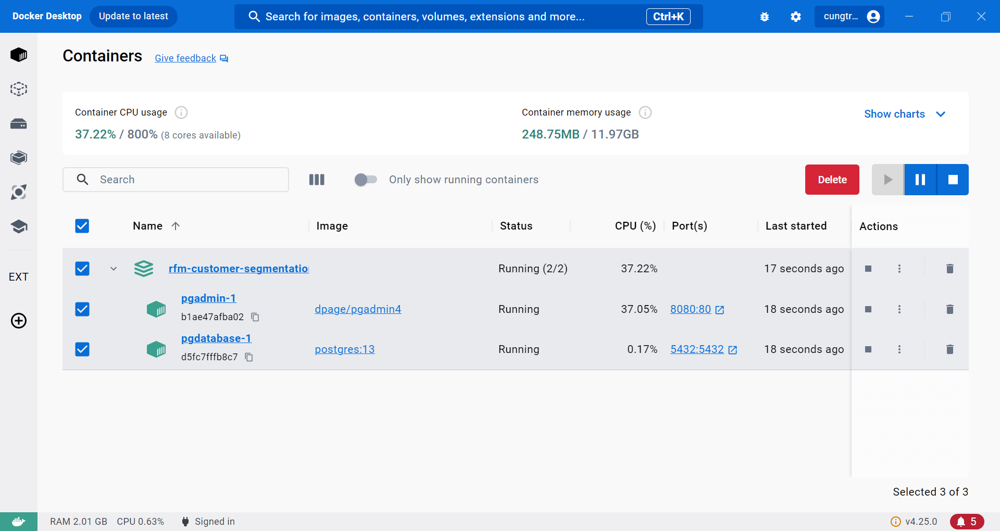
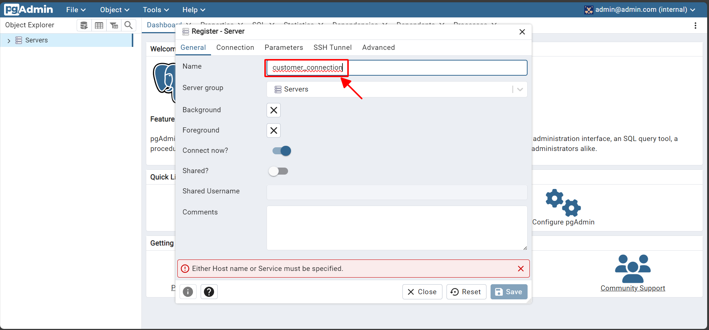
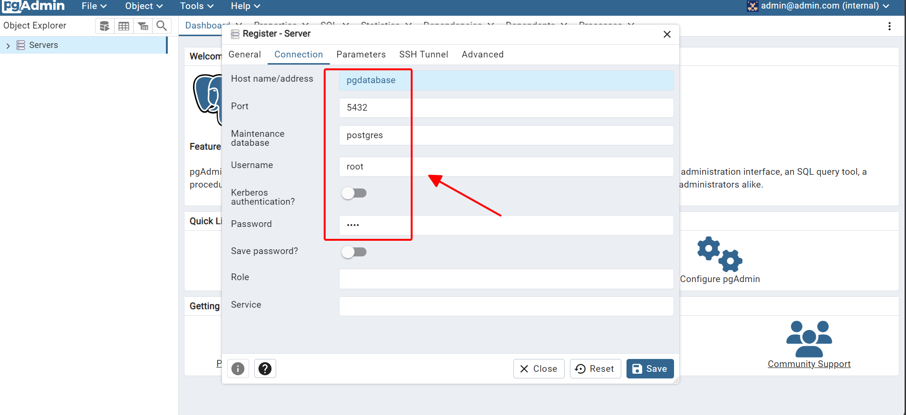
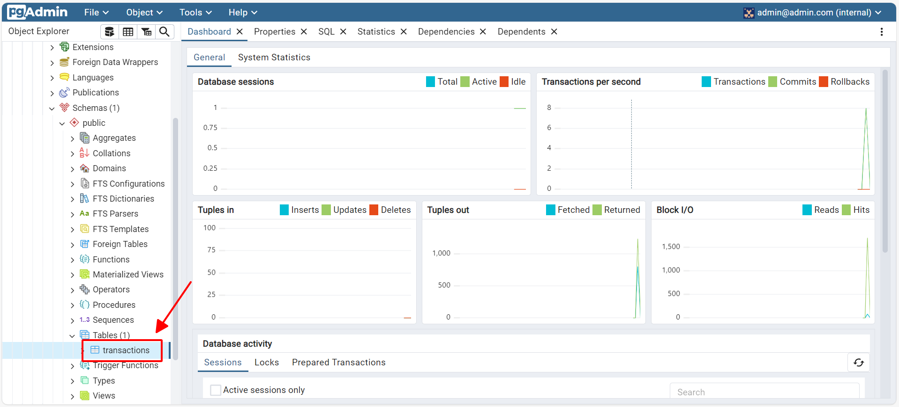
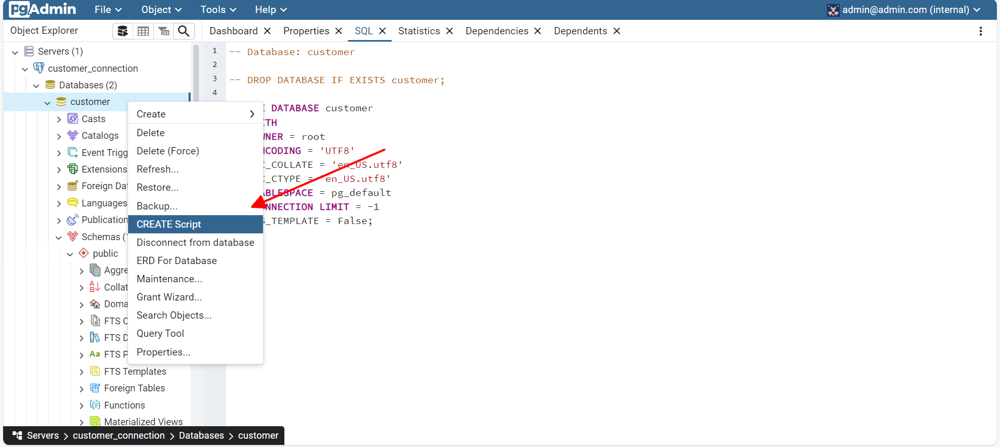
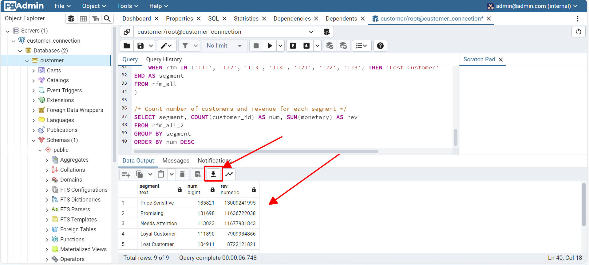
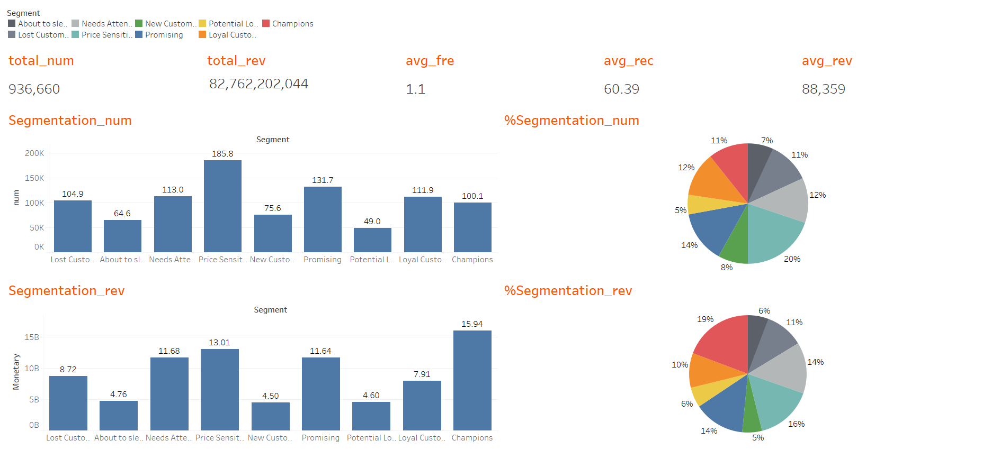

# RFM Customer Segmentation - Data Analystics Project

## Table of Contents
- [Introduction](#introduction)
- [System Components](#system-components)
- [What You'll Learn](#what-youll-learn)
- [Technologies](#technologies)
- [Walkthrough](#walkthrough)

## Introduction
The purpose of this project is to prepare a report on customer segmentation based on the company’s business performance over the past six months. The report applies the RFM model as a classification measure, using descriptive analysis techniques for implementation.

## System Components
- **ingest_data.py**: This code snippet helps to download the `transactions.csv` file and ingest this data into the Postgres data warehouse.

- **db_config.py**: This code snippet contains information about the data warehouse.

## What You'll Learn
- Ingesting data
- Extracting data using PostgreSQL (ELT)
- Visualizing data using Tableau
- Writing a descriptive analysis report

## Technologies
- Docker
- Python
- Postgres DB
- Tableau

## Walkthrough
1. Download the code and set up Docker environment

- Clone this respository
    ```bash
    git clone https://github.com/hauct/RFM-Customer-Segmentation.git
    ``` 

- Open your Docker Desktop, build the containers
    ``` bash
    docker compose up -d
    ```

    Make sure these containers are running in your Docker

    

2. Run ingesting data code

- Change to folder `ingest_data`, run this on your terminal

    ``` bash
    pip install -r requirements.txt
    python ingest_data.py
    ```

3. Connect to database
- Click on port `8080:80` on Docker Desktop to get access to Pgadmin (UI/UX tool of PostgresDB). The username and password are `admin@admin.com` and `root`. Setting the config as images below:

    |                                          |                                          |
    |------------------------------------------|------------------------------------------|
    |||

- Make sure you see the table `transactions` appeared in the database



4. Query data
- Click on `Create SCRIPT`, now in our project directiory, move to folder `sql` and copy the SQL script in `scripts.sql`, paste it into the IDE of your Postges

    |                                |                                |
    |--------------------------------|--------------------------------|
    |||

- After done this, you will have the data for visualizing, i will name it `rfm_all_2.csv` and place it in folder `sql`

5. Visualize data
- I strongly recommend you [Tableau](https://www.tableau.com/products/trial) to visualize our data. It will give you 14 days-trial after finishing your registration

- You may want to refer my dashboard `customer_segment_dash.twb` in folder `report`



6. Do report
- Please view this [here](report/customer_segment_report.pdf)

And this is the end of my project. Thanks for reading.

